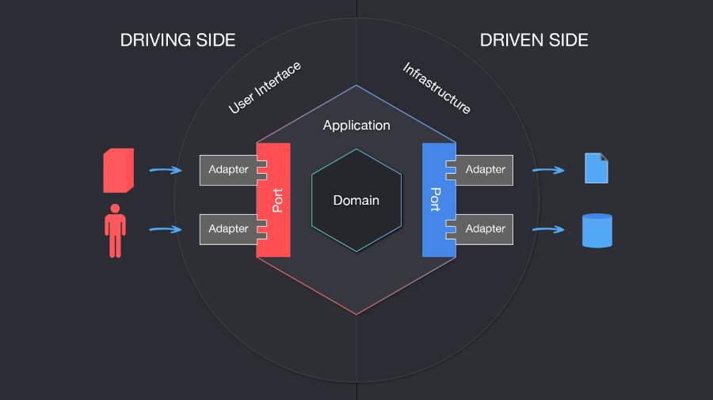

# Serviço de simulação de proposta

Esse serviço provê uma API para simular as condições de um financiamento a partir de um produto selecionado.

# Como executar esse projeto

1. Clone o repositório
2. Instale as dependências utilizando `npm i`
3. Inicie o banco de dados através do docker-compose, executando: `docker-compose up -d`
4. Define as variáveis de ambiente em `.env`, conforme o arquivo `.env.example`
5. Execute as migrations do banco de dados: `npm run migration:run`
6. Execute a aplicação utilizando `npm run start`
7. Por padrao a aplicação será disponibilizada na porta `3000`, nesse cenário, acesse: `http://localhost:3000/`
8. Acesse `http://localhost:3000/api` para visualizar a documentação da API

# Tecnologias utilizadas

Essa API utiliza as seguintes tecnologias associadas à uma arquitetura hexagonal:

- NestJS - Framework para construção de backends (utilizado como adapter para prover uma API para o usuário).
- TypeORM - ORM para abstrair interações com o banco de dados
- PostgreSQL - Banco de dados relacional

# Arquitetura



A arquitetura utilizada é a arquitetura hexagonal, que é uma arquitetura baseada em portas e adaptadores. Essa arquitetura é composta por 3 camadas:   

- Domínio/Entidades
- Aplicação/Use Cases
- Infraestrutura/Adapters

Com relação as portas (`src/domain/ports`) e adaptadores (`src/adapters`): as portas são interfaces que são implementadas pelas classes de adaptadores. Essas interfaces são utilizadas para que a camada de aplicação não tenha dependências diretas com a camada de infraestrutura. Dessa forma, a camada de aplicação é independente da camada de infraestrutura, e a camada de infraestrutura é independente da camada de aplicação.

## Domínio/Entidades (`src/domain`)

A camada de domínio é responsável por conter as entidades do domínio da aplicação. Essas entidades são responsáveis por representar as regras de negócio da aplicação. Essa camada não deve conter nenhuma dependência externa, como por exemplo, dependências de banco de dados, frameworks, etc. Na prática manteremos nessa camada arquivos de interface e classes abstratas.

## Aplicação/Use Cases (`src/useCases`)

A camada de aplicação é responsável por conter os casos de uso da aplicação. Esses casos de uso são responsáveis por conter a lógica de negócio da aplicação. Essa camada não deve conter nenhuma dependência externa, como por exemplo, dependências de banco de dados, frameworks, etc. 

## Infraestrutura/Adapters (`src/adapters`)

A camada de infraestrutura é responsável por conter as implementações das interfaces definidas na camada de domínio. Essas implementações são responsáveis por conter a lógica de acesso a dados, frameworks, etc. Essa camada deve conter apenas implementações, não deve conter nenhuma regra de negócio. Na prática manteremos nessa camada o NestJS, TypeORM, etc.

## Estrutura de diretório

```
.
└── src/
    ├── adapters/
    │   ├── repository/
    │   │   └── typeorm/
    │   └── controller/
    │       └── rest/
    ├── domain/
    │   ├── ports/
    │   │   └── simulation.repository.ts
    │   └── simulation/
    │       └── simulation.ts
    └── useCases/
        └── createSimulationervice.ts
```

# Documentação da API

Esta API utiliza o Swagger para documentar sua API. Para acessar a documentação, acesse: `http://localhost:3000/api`.
Para que a documentação seja clara é importante que façamos as annotations corretamente, leia mais em: https://docs.nestjs.com/openapi/introduction.

# Premissas de desenvolvimento

## Breaking changes
Não implementar breaking changes. Essa API é utilizada por outras aplicações, portanto, não podemos quebrar a API de forma alguma. Para isso, é importante que ao implementarmos uma nova feature façacamos de forma que a API continue funcionando para os clientes que já estão utilizando a API.

## Migrations

Para que possamos fazer alterações no banco de dados, é necessário que criemos uma migration. Para isso, materemos os seguintes comandos:

- `npm run migration:generate`, exemplo: `npm run migration:generate src/adapters/repository/typeorm/migrations/AddColumnToSimulation`
- `npm run migration:create`, exemplo: `npm run migration:create src/adapters/repository/typeorm/migrations/AddColumnToSimulation`

A diferença entre o `create` e `generate` é que o `create` cria uma migration vazia, enquanto o `generate` cria uma migration com base nas alterações feitas no banco de dados.

## Convenção de nomes

Ao longo da aplicação é esperado que sigamos a convenção camelCase para nomes de variáveis, métodos, arquivos e diretórios. Para classes é esperado que sigamos a convenção PascalCase.

# Ownership do repositório

O repositório é de propriedade da equipe de Simulação e Proposta.